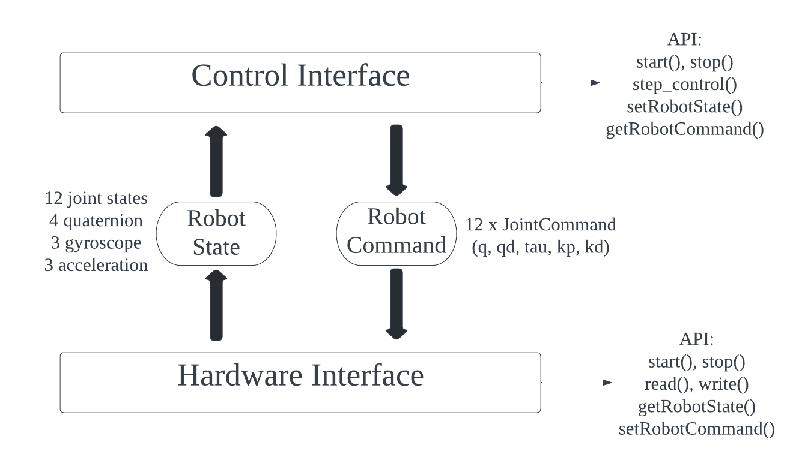

# Modular Control Architecture

This repo aims to design a unified and modular control architecture that enables easy interchanging of high-level controllers and low-level hardware. 


## Design

### API

The API for the controller and hardware interfaces is defined in `interfaces` 



### Example Application

Using this architecture, control and hardware construction and initialization details are abstracted away and hidden behind simple interfaces. 

```
    auto hardware = FakeHardware();
    auto controller = FakeController();
    hardware.start();
    controller.start();

    // Initialize static memory
    static interfaces::RobotState robotState; 
    static interfaces::RobotCommand robotCommand;
```

A minimal control loop can be compactly defined in about 10 lines of code. 

```
    // Implement control loop
    while (true)
    {
        // Communicate robot state from hardware to controller
        hardware.read();
        hardware.getRobotState(robotState);
        controller.setRobotState(robotState);
        // Compute control command
        controller.step_control();
        // Communicate robot command from controller to hardware
        controller.getRobotCommand(robotCommand);
        hardware.setRobotCommand(robotCommand);
        hardware.write();
    }
```

The above control loop serves as a simple base on which to implement other features, e.g.:
- sleeping for a set time every loop
- implementing thread-safety with mutexes

## Roadmap

- [x] Design interfaces
- [x] Implement example dummy hardware and controller
- [x] Implement Unitree hardware 
- [ ] Implement example controller
- [ ] Verify that full control setup works on hardware

## Quickstart

### Install Dependencies (Docker)
This repository comes bundled with a Docker development container that bundles the dependencies necessary to build the project. It can be opened using VSCode Remote Containers extension

### Build Executables

```
mkdir build
cd build
cmake ..
make 
```

 

## Development Guide

It is recommended to adhere to the interfaces provided: 
- The Controller layer computes the control action from the robot state
- The Hardware layer accepts the control action and passes it to the hardware, then reads in the new robot state
- The application runs both Controller and Hardware in a loop. 

`examples/fake_application` demonstrates how to implement a simple application with dummy controller and hardware.

### Compiling

All three example applications can be built and compiled in the provided Docker environment. It is convenient to use VSCode Remote Containers extension for this purpose

### Running on Unitree Hardware

See `docs/deploy_hardware.md` for detailed instructions on running binaries on Unitree robots. 

### Running ROS node

`examples/ros_application.cpp` contains an example application that runs a ROS node in isolation. It can be built with just CMake and without catkin (which is CMake-based anyway). 

The ROS application assumes `roscore` is already running and sets up publishers and subscribers on the same channels used by the Gazebo simulation stack found here: https://github.com/mcx-lab/static_walker

After you have started the Gazebo simulation, the example ROS application can be used to run the controller. `SineController` will likely not be strong enough for the robot to stand up, but can be replaced with a more functional controller. 

### Modifying Unitree legged msgs

The ROS application depends on custom messages defined in `hardware/ros_hardware/include/unitree_legged_msgs`. The header files are obtained by compiliing `unitee_legged_msgs` (refer to https://github.com/mcx-lab/quadruped_controller_ros/tree/main/unitree_ros/unitree_legged_msgs) in a `catkin` workspace. The header files can be found in `devel/include/unitree_legged_msgs`. Note that this process must be done again if the `unitree_legged_msgs` are ever changed. 

### Extending the interfaces

`ControllerInterface` and `HardwareInterface` provide a simple and minimal interface for control. Where possible, it is recommended to keep the existing interfaces as-is and use subclasses to implement additional functionality. 

For example, if we have terrain perception, the Hardware class can be extended to include a `getTerrainState()` method, and the Controller class can include a `setTerrainState()` method. Then, a custom application can be written that includes both the new methods in the control loop. 
